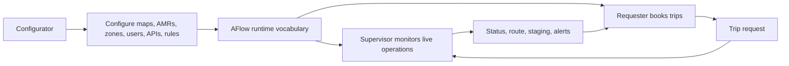
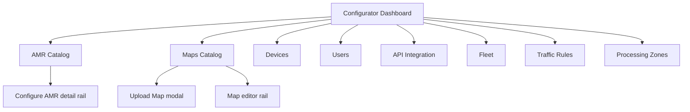
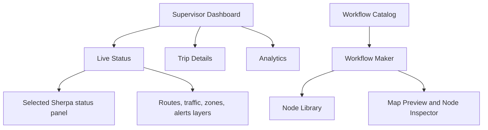
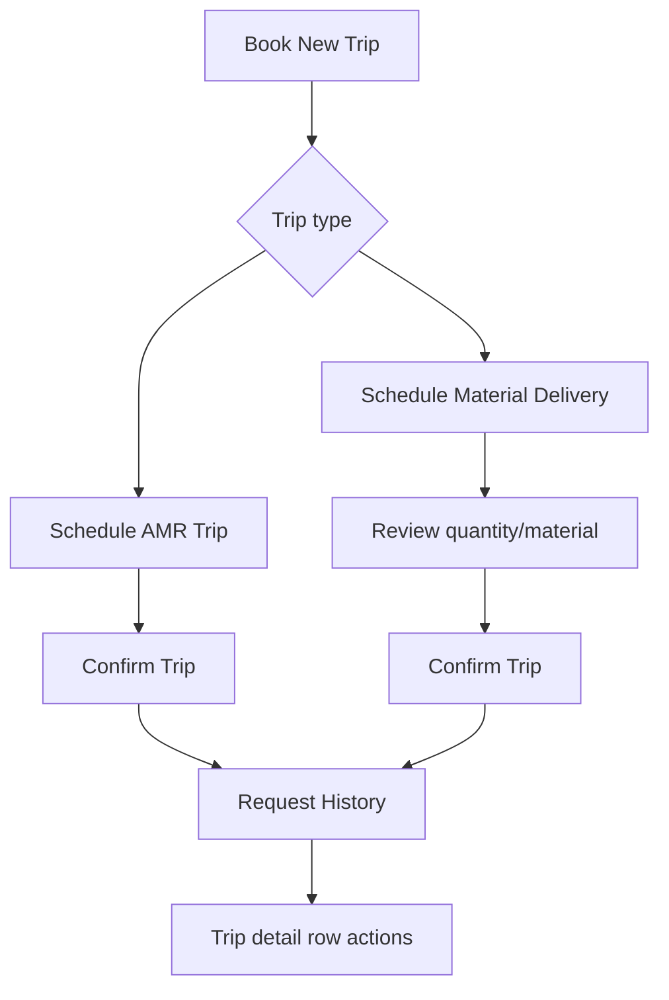

# Roles and Flows

## Role Model

| Role | Responsibility | Primary Screens |
| --- | --- | --- |
| Configurator | Defines operational setup and source configuration | Dashboard, AMR, Maps, Devices, Users, API Integration, Fleet, Traffic Rules, Triggers, Processing Zones, Notifications |
| Supervisor | Monitors and adjusts runtime operations | Dashboard, Live Status, Analytics, Trips, Staging Area, WIP Inventory, Workflow, Notifications |
| Requester | Creates and tracks movement requests | Book New Trip, Request History, Live Status, Staging Area, Alerts |

## End-to-End Flow

## Configurator Flow

Configurator starts at the dashboard. Each dashboard card links to the corresponding module.

## Supervisor Flow

Supervisor uses the runtime configuration to monitor work, inspect trips, and edit workflows.

## Requester Flow

Requester can start from history or book a new trip.

## State Rules

- Current role is derived from the URL.
- Role switching navigates to that role's home route.
- Sidebar active state is path-aware.
- Detail panels and support drawer are local UI state.
- Booking form state is local to the booking screen.
- Workflow node state is local to the workflow builder.
