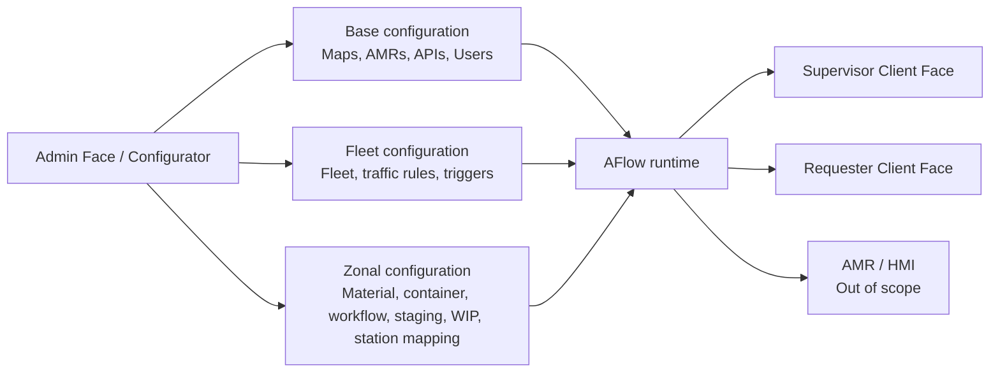
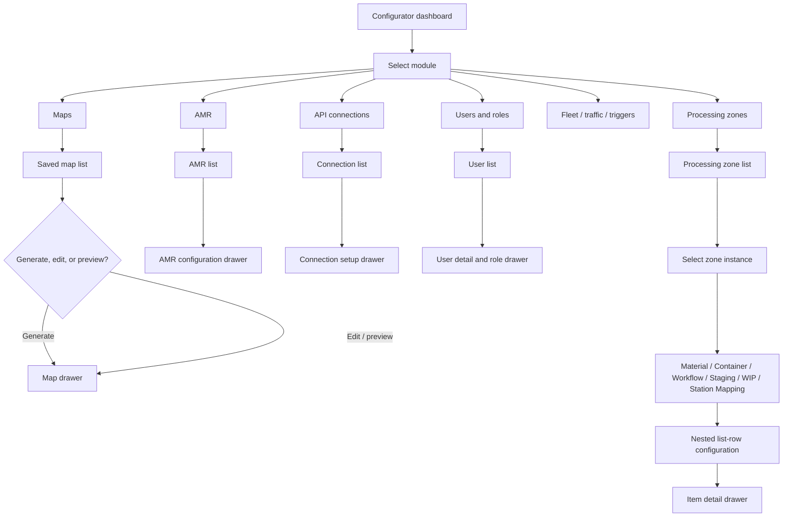
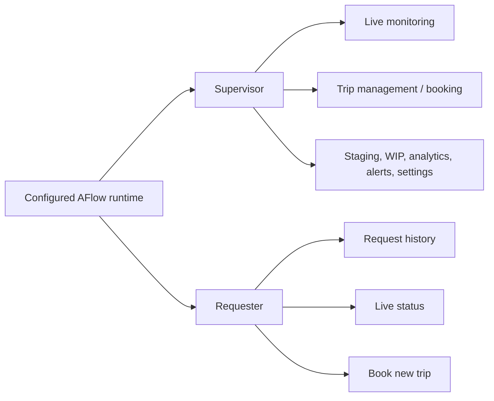
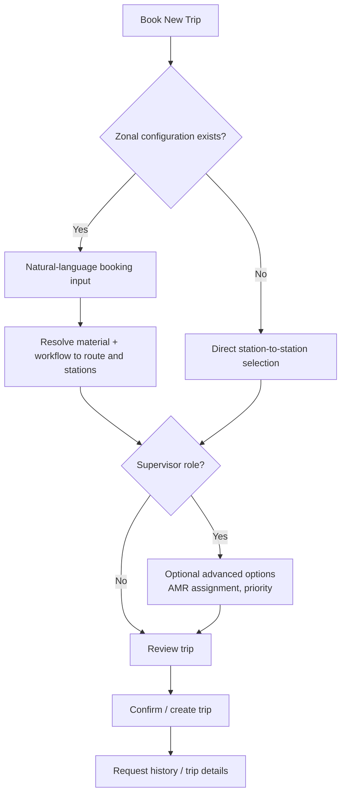

# AFlow Flow Map

This document records the flows extracted from the supplied Figma references and maps them to the current repository state. The detailed task, HLD, LLD, acceptance, and review contract lives in [`aflow-implementation-spec.md`](./aflow-implementation-spec.md).

Sources:

- [Mid-Fi-Wireframes, system reference](https://www.figma.com/design/ELjjOqInI3YEz3KhUH0OOm/Mid-Fi-Wireframes?node-id=181-335)
- [Mid-Fi-Wireframes, reference section 153-9](https://www.figma.com/design/ELjjOqInI3YEz3KhUH0OOm/Mid-Fi-Wireframes?node-id=153-9)
- [Mid-Fi-Wireframes, reference section 153-6](https://www.figma.com/design/ELjjOqInI3YEz3KhUH0OOm/Mid-Fi-Wireframes?node-id=153-6)
- [Mid-Fi-Wireframes, reference section 153-7](https://www.figma.com/design/ELjjOqInI3YEz3KhUH0OOm/Mid-Fi-Wireframes?node-id=153-7)
- `Downloads/AFlow-ClaudeDesign-Handoff-Combined.md`

## System Flow

The platform has an Admin Face and a Client Face. Admin configuration is the source of the client vocabulary and available capabilities. The HMI is represented in the reference diagram but is explicitly out of scope for this wireframe pass.

## Configurator Flow

The base-level configurator establishes the reusable list and item-detail interaction. Navigation moves to a module canvas; selecting or adding an item opens a right-side drawer while preserving the list behind it. Processing Zone selection then exposes nested configuration through the six zone tabs.

## Client Role Flow

The current prototype implements Supervisor and Requester client experiences. Structural chrome is shared, while filters and actions are configuration-dependent.

## Conditional Booking Flow

`Book New Trip` is a shared entry point. When zonal configuration exists, the client uses Material and Workflow vocabulary. Without it, the fallback is direct station-to-station selection. Supervisor adds an optional Advanced Options override for AMR assignment and priority.

## Code Map

| Figma flow or surface | Current code | Status |
| --- | --- | --- |
| Shared app shell and role switching | `src/aflow-prototype/AFlowPrototype.tsx` and `AFlowPrototype.css` | Implemented with URL-derived role/navigation, boundary-aware active route matching, role switcher, responsive sidebar, support panel, and mock state |
| Configurator dashboard, AMR, Maps, API, Users, Zones | `src/aflow-prototype/AFlowPrototype.tsx` | Implemented as screenshot-matched dashboard and catalog screens |
| Requester history, live status, booking | `src/aflow-prototype/AFlowPrototype.tsx` | Implemented with mock trip data, live map view, AMR route booking, and material delivery booking |
| Supervisor dashboard, trips, staging, WIP, analytics | `src/aflow-prototype/AFlowPrototype.tsx` | Implemented as interactive prototype views |
| Router entry point | `src/App.tsx`, `src/main.tsx` | `App` mounts the AFlow prototype through React Router; no backend or setup gate is required |
| Engineering contract and agent workflow | `AGENTS.md`, `docs/aflow-implementation-spec.md` | Defines HLD, LLD, task sequencing, acceptance criteria, scope, and implementer/reviewer re-audit gates |

## Engineering Implications

1. Keep navigation and domain state independent from visual assets. The prototype now uses routes and component state, so the Figma images remain read-only references rather than runtime dependencies.
2. Model configuration capabilities as data derived from the Admin Face. Client sidebar filters and booking vocabulary must be generated from configured zones, materials, and workflows rather than hardcoded to `Machine` and `Workflow`.
3. Keep item detail in a reusable drawer state. Do not turn item edits into full-canvas navigation.
4. Replace mock arrays with API adapters when a backend is introduced; keep the screen components and route contract stable.
5. Treat this document as a flow contract. Any unresolved Figma/TBD behavior should remain explicitly marked until confirmed rather than being silently encoded in UI logic.
