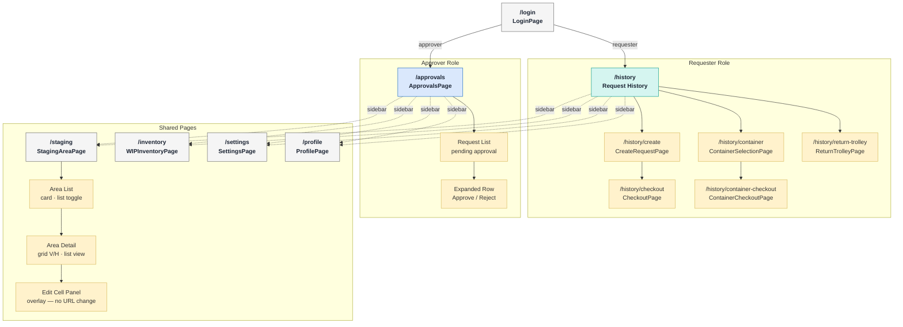

# Information Architecture

This page documents the complete navigation and page structure for AtiFLOW v2.0.
The app supports two device roles on a single codebase — **Requester** and **Approver** — each with a distinct set of primary pages plus a set of shared pages accessible to both.

---

## Interactive Diagram

The `.drawio` source is embedded below via diagrams.net. You can pan, zoom, and click elements interactively.

<iframe
  src="https://viewer.diagrams.net/?url=https://raw.githubusercontent.com/akankshyapradhan22/atiflow/main/docs/atiflow-ia.drawio&highlight=0000ff&nav=1&title=AtiFLOW+IA"
  width="100%"
  height="640"
  style="border: 1px solid #e0e0e0; border-radius: 8px;"
  frameborder="0"
  allowfullscreen
></iframe>

[Download source `.drawio` file](atiflow-ia.drawio){ .md-button }

---

## Navigation Flowchart

Same diagram as a Mermaid flowchart — rendered inline, no external dependency.

**Colour key:**

| Colour | Meaning |
|---|---|
| Teal border | Requester-only page |
| Blue border | Approver-only page |
| Grey border | Shared page (both roles) |
| Amber border | Sub-view or sub-step (local state, URL unchanged) |
| Dashed arrow | Sidebar navigation (always accessible once logged in) |

---

## Page Inventory

### Requester (login `PA01` / `1234`)

| Route | Component | Notes |
|---|---|---|
| `/history` | `RequestHistoryPage` | Home — request list with tab filters |
| `/history/create` | `CreateRequestPage` | Entry point for all 3 request types |
| `/history/checkout` | `CheckoutPage` | Material cart review and submit |
| `/history/container` | `ContainerSelectionPage` | Container type + subtype selection |
| `/history/container-checkout` | `ContainerCheckoutPage` | Container cart review and submit |
| `/history/return-trolley` | `ReturnTrolleyPage` | QR scan or manual trolley return |

### Approver (login `AP01` / `1234`)

| Route | Component | Notes |
|---|---|---|
| `/approvals` | `ApprovalsPage` | Pending request list — expand to approve/reject |

### Shared (both roles, via sidebar)

| Route | Component | Notes |
|---|---|---|
| `/staging` | `StagingAreaPage` | 3-area grid with cell detail and edit overlay |
| `/inventory` | `WIPInventoryPage` | WIP inventory list/grid with status tabs |
| `/settings` | `SettingsPage` | Device and app settings |
| `/profile` | `ProfilePage` | Operator profile |

---

## Navigation Patterns

| Pattern | Used for |
|---|---|
| `useNavigate(path)` | Button/form submit — forward navigation |
| `useNavigate(-1)` | Back arrow in sub-headers |
| `<Navigate replace />` | Auth guard redirects, post-login |
| Local `useState` | StagingAreaPage (area list ↔ area detail), ReturnTrolleyPage (method screen) |

Sub-views that use local state do **not** change the URL. The browser back button will exit the page rather than returning to the sub-view.
